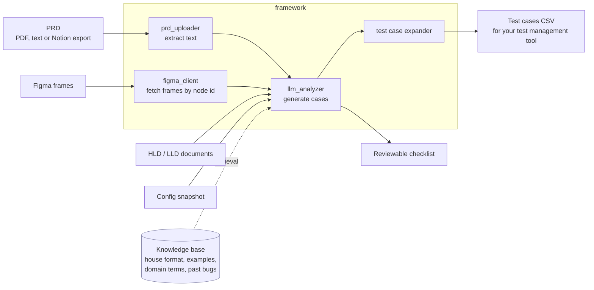

# prd-figma-test-generator


Turns product documents into test cases. Feed it a PRD (PDF, text or Notion
export) and optionally the Figma frames for the same feature, and it produces a
structured test suite: CSV for your test management tool, plus a reviewable
checklist.

It is not a "generate tests from code" tool. It reads the specification, which
is where the requirements actually live, and where the gaps that cause escaped
defects actually are.

## What it produces

A CSV that drops into a test management tool, one row per case:

```
Test Case ID, Priority, Category, User Type, Screen Reference, Precondition,
Test Scenario, Steps to Execute, Expected Result, Dev Status, QA Status, Comments
```

```
TC_UI_POS_001_7A3E   P0   Happy Path   Verify that valid credentials are accepted
```

The column set is configurable in `framework/prompts/test_case_prompt.py` —
match your team's taxonomy there and the output needs no reshaping.

## Why the Figma input matters

A PRD tells you the rules. The design tells you the states. Most missed test
cases live in the gap between them: the empty state nobody wrote a requirement
for, the error toast that only exists in the mockup, the disabled button on the
third variant of a screen.

Passing both to the model at once produces cases that neither source would have
yielded alone. Adding HLD/LLD context on top gets you the backend conditions,
retries, idempotency, partial failures, that a PRD never mentions.

## Pipeline



The knowledge base is what keeps output consistent with how *your* team writes
tests. It holds your test case format, worked examples, domain terminology, user
journeys, and bug patterns learned from past escapes. Retrieval pulls the
relevant slices into the prompt, so generated cases match house style instead of
generic LLM phrasing.

## The example domain

The prompts and knowledge base ship configured for a fictional consultation
marketplace with subscriptions, a wallet, provider chat and payments.

**This is a worked example, not a framework constraint.** It is filled in
because an empty prompt template teaches you nothing about the level of detail
required. To use this for real, replace:

| File | Holds |
|---|---|
| `framework/prompts/test_case_prompt.py` | Output format, screen codes, your test taxonomy |
| `docs/knowledge_base/domain_knowledge.md` | Your product's terminology and rules |
| `docs/knowledge_base/user_journeys.md` | The flows that matter in your product |
| `docs/knowledge_base/test_case_format.md` | Your team's column and phrasing conventions |
| `docs/knowledge_base/bug_patterns.md` | Failure modes your product actually has |

Expect to spend real time on `bug_patterns.md`. It is the file that turns
generic output into output worth reviewing, and it is the one that can only come
from your own defect history.

## Setup

```bash
python -m venv venv && source venv/bin/activate
pip install -r requirements.txt

cp .env.example .env      # add your LLM and Figma tokens
```

Run the API and UI:

```bash
python app.py             # FastAPI backend
cd frontend && npm install && npm run dev
```

Or from the command line:

```bash
python cli.py --prd path/to/prd.pdf --output output/
```

## Configuration

`.env` needs an LLM API key and, for design input, a Figma personal access
token (`figd_…`) plus the file key of the design you want read.

Optional: a Zookeeper endpoint, if you want the generator to read live feature
flags and service config so it can produce cases for the configuration your
environment is actually running. `framework/zk_client.py` walks a config tree
and `framework/zk_config_parser.py` turns it into testable conditions.

## RAG backends

Retrieval runs over a Qdrant vector store. Embeddings come from a swappable
provider, so the pipeline runs hosted or entirely on your own machine:

| Provider | Model | Dimensions |
|---|---|---|
| `openai` | `text-embedding-3-small` | 1536 |
| `openai-large` | `text-embedding-3-large` | 3072 |
| `local` | `all-MiniLM-L6-v2` | 384 |

Generation goes to Anthropic or OpenAI. With `local` embeddings and a local
model, no document leaves your machine — which matters, because the input here
is unreleased product specification.

Two retrieval setups ship, because they suit different sizes:

- `rag/simple_rag.py` for a modest knowledge base, no external services.
- `lightrag_setup/` for indexing a whole codebase alongside the docs, via Docker.

Start with the simple one. Reach for LightRAG when you want the generator to
cite actual implementation rather than just the spec.

## Honest limitations

Generated cases need human review. The tool is good at coverage breadth and
consistent formatting, and it is unreliable on anything requiring product
judgement about what *should* happen when the spec is silent. That silence is
exactly where the interesting bugs are, so treat the output as a first draft
that gets a human pass, not as a finished suite.

It also cannot tell you a requirement is wrong. It will faithfully generate
tests that lock in a bad rule.

## License

MIT. See [LICENSE](LICENSE).
